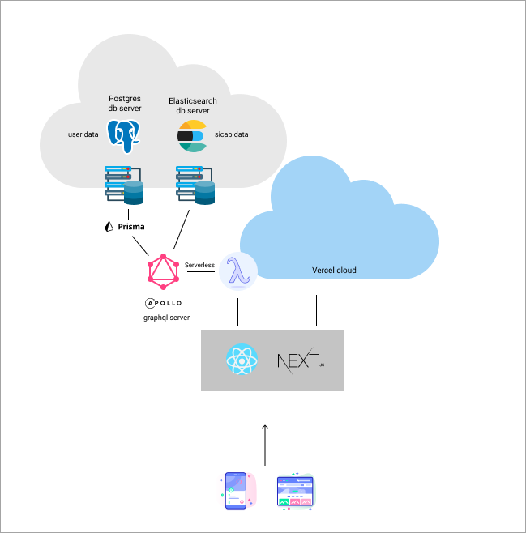

# sicap.ai

Tehnologii folosite

- React ([NextJS](https://nextjs.org/))
- [Chakra UI](https://chakra-ui.com/)
- [Prisma](https://www.prisma.io/) cu adaptor pentru PostgreSQL
- [GraphQL](https://graphql.org/)
- [Apollo](https://www.apollographql.com/)
- [Elasticsearch](https://www.elastic.co/elasticsearch)

Arhitectura

[](#arhitectura)

Pentru a rula local e nevoie sa redenumesti .env.example in .env si sa modifici variabilele de configurare:

```bash
# db
DATABASE_URL="url postgres"
ES_URL="url elasticsearch"
# auth
GOOGLE_ID=""
GOOGLE_SECRET=""
SECRET=""
NEXTAUTH_URL="http://localhost:3000"
# elastic apm
NEXT_PUBLIC_APM_RUM_URL="url elastic apm"
ELASTIC_APM_SERVER_URL="url elastic apm"
ELASTIC_APM_SECRET_TOKEN=""
ELASTIC_APM_ENVIRONMENT=""
ELASTIC_APM_SERVICE_NAME=""
```

pentru a rula nextjs dev server

```bash
npm run dev
```
